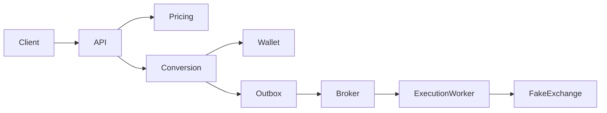
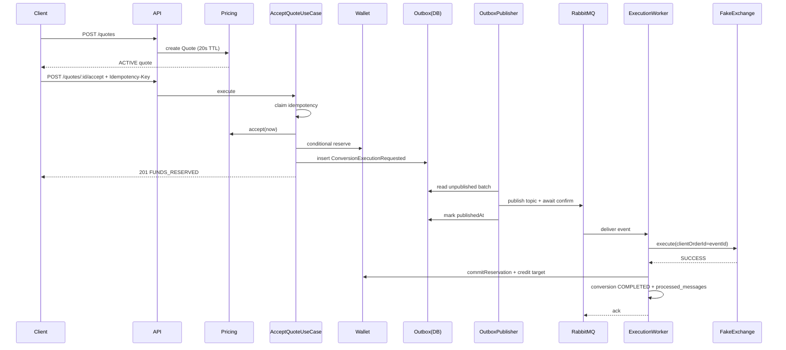
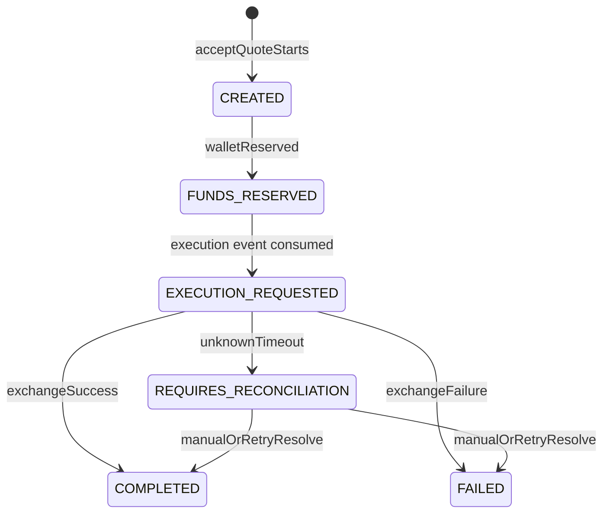

# Architecture

## System overview

Wallet Conversion Engine is a NestJS **modular monolith** that implements a short-lived
digital-asset conversion flow:

1. Create a quote (`POST /quotes`) with a deterministic fake rate and 20s TTL.
2. Accept the quote (`POST /quotes/:quoteId/accept` + `Idempotency-Key`) inside one PostgreSQL
   transaction: accept quote → create conversion → reserve wallet funds → write outbox event.
3. Publish the outbox event to RabbitMQ (`conversion.execution.requested`).
4. Consume the event, call a fake exchange adapter, then settle (commit + credit) or release
   the reservation.
5. Query status (`GET /conversions/:conversionId`) and scrape Prometheus (`GET /metrics`).

PostgreSQL is the source of truth for balances, quote/conversion state, idempotency, outbox,
and consumer processed-message markers. RabbitMQ provides at-least-once delivery between the
outbox publisher and the execution worker.

## Context diagram



## Module boundaries

```
src/modules/
  pricing/     # Quote lifecycle + deterministic FakePricingProvider
  wallet/      # WalletAccount aggregate + conditional SQL reserve/release/commit/credit
  conversion/  # Conversion aggregate, accept orchestration, outbox, RabbitMQ, fake exchange
  shared/      # Money, Asset, Prisma, logging, metrics, clock/id ports
```

Each module uses layers: `domain` → `application` → `infrastructure` / `presentation`.

## Dependency direction

- **Domain** has no NestJS, Prisma, HTTP, amqplib, or Prometheus dependencies. The only approved
  external library is `decimal.js` for exact money arithmetic.
- **Application** orchestrates domain ports (repositories, UnitOfWork, Clock, ExchangeExecution)
  and may use Nest DI wiring plus shared metrics recording.
- **Infrastructure** implements ports (Prisma repositories, RabbitMQ, fake adapters).
- **Presentation** (controllers) depends on application use cases and maps HTTP ↔ DTOs.
- Cross-context coordination (accept) lives in the **conversion** application layer and uses
  a shared Unit of Work so wallet + quote + conversion + outbox share one DB transaction.

## Transaction boundaries

| Operation        | Boundary                          | What is atomic                                                                                        |
| ---------------- | --------------------------------- | ----------------------------------------------------------------------------------------------------- |
| Accept quote     | Single Prisma `$transaction`      | Idempotency claim, quote accept, conversion `CREATED`→`FUNDS_RESERVED`, wallet reserve, outbox insert |
| Outbox publish   | Per-row after broker confirmation | Mark `publishedAt` only after RabbitMQ publisher confirm                                              |
| Execution settle | Single Prisma `$transaction`      | `processed_messages` claim, wallet commit/release + credit, conversion terminal status                |

Business accept failures throw `AcceptAbortedError` so the whole accept TX (including the
idempotency claim) rolls back — failed accepts do not poison keys.

## Sequence diagram — successful accept + execution



## State diagram — conversion lifecycle



`CREATED` exists so the conversion is persisted before funds move; within the same accept
transaction it immediately transitions to `FUNDS_RESERVED` after a successful reserve.

## Event flow

1. Accept writes `outbox_messages` with type `ConversionExecutionRequested` and JSON payload
   (`eventId`, `conversionId`, amounts as decimal strings, `occurredAt`).
2. `OutboxPublisherService` polls unpublished rows in configurable batches (`OUTBOX_BATCH_SIZE`),
   publishes persistent messages to RabbitMQ topic `conversion.execution.requested` through a
   confirm channel, then sets `publishedAt`.
3. `ExecutionConsumerService` consumes, invokes `ProcessConversionExecutionUseCase`, acks on
   success, and uses bounded broker republishing on unexpected errors. Messages exceeding
   `RABBITMQ_CONSUMER_MAX_RETRIES` are routed to the dead-letter queue.
4. Consumer idempotency: unique `processed_messages(event_id)`. Duplicate deliveries are no-ops.

## Outbox flow

```
Accept TX commit
    → row in outbox_messages (published_at NULL)
    → publisher reads LIMIT N unpublished
    → persistent publish to RabbitMQ confirm channel
    → wait for broker confirm and backpressure drain when required
    → UPDATE published_at = now()
    → on broker failure/timeout: leave unpublished, increment outbox_publish_failure_total,
      retry next poll
```

Residual risk: publish succeeds but the process crashes before marking published → duplicate
publish. Mitigation: consumer idempotency on `eventId` and the fake exchange's PostgreSQL-persisted
result keyed by `clientOrderId = eventId`.

## Deployment assumptions

- Single deployable Node process runs API + outbox publisher + execution consumer.
- Docker Compose provides PostgreSQL and RabbitMQ for local/dev; optional `app` service builds
  the Nest image.
- Env vars from `.env.example` control messaging loops (`MESSAGING_ENABLED`,
  `OUTBOX_PUBLISHER_ENABLED`, `EXECUTION_CONSUMER_ENABLED`) so tests can disable background
  loops and drive publish/process explicitly.
- RabbitMQ reconnect uses bounded exponential backoff and restores registered consumers after
  channel recovery. Exhausted poison-message retries are dead-lettered.
- Completed idempotency records are cleaned after a configurable 24h retention period in bounded
  batches; in-progress records are retained.
- No Kubernetes manifests, OpenTelemetry, or Redis (explicit non-goals).
- Wallet funding is via seed / test helpers — no public create-wallet API in scope.
